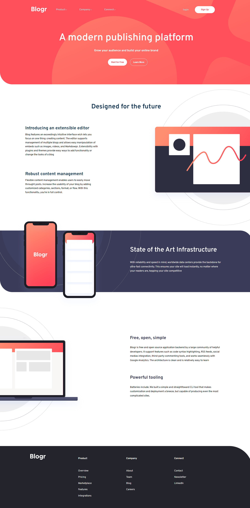

<h1 align="center">Junior-Ex-Front-React-blogr-landing-page-main</h1>

###

  
  
  
  
  
  
  

###

###

n.b. Manca ancora l'interattività e la parte Responsive   📝 Brief Your challenge is to build out this landing page and get it looking as close to the design as possible.  You can use any tools you like to help you complete the challenge. So if you've got something you'd like to practice, feel free to give it a go.  This challenge mostly focuses on HTML & CSS. The only JavaScript required is for the mobile menu.  Your users should be able to:  View the optimal layout for the site depending on their device's screen size See hover states for all interactive elements on the page Download the starter code and go through the README.md file. This will provide further details about the project. The style-guide.md file is where you'll find colors, fonts, etc.  Want some support on the challenge? Join our community and ask questions in the help channel.

###

# React + Vite

This template provides a minimal setup to get React working in Vite with HMR and some ESLint rules.

Currently, two official plugins are available:

- [@vitejs/plugin-react](https://github.com/vitejs/vite-plugin-react/blob/main/packages/plugin-react) uses [Babel](https://babeljs.io/) (or [oxc](https://oxc.rs) when used in [rolldown-vite](https://vite.dev/guide/rolldown)) for Fast Refresh
- [@vitejs/plugin-react-swc](https://github.com/vitejs/vite-plugin-react/blob/main/packages/plugin-react-swc) uses [SWC](https://swc.rs/) for Fast Refresh

## React Compiler

The React Compiler is not enabled on this template because of its impact on dev & build performances. To add it, see [this documentation](https://react.dev/learn/react-compiler/installation).

## Expanding the ESLint configuration

If you are developing a production application, we recommend using TypeScript with type-aware lint rules enabled. Check out the [TS template](https://github.com/vitejs/vite/tree/main/packages/create-vite/template-react-ts) for information on how to integrate TypeScript and [`typescript-eslint`](https://typescript-eslint.io) in your project.
